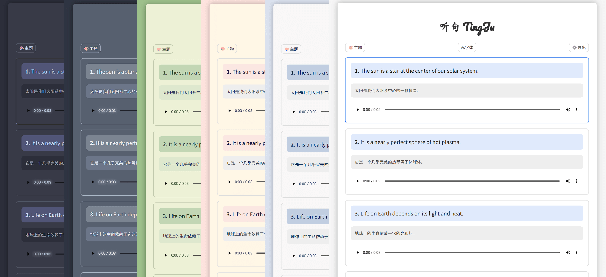
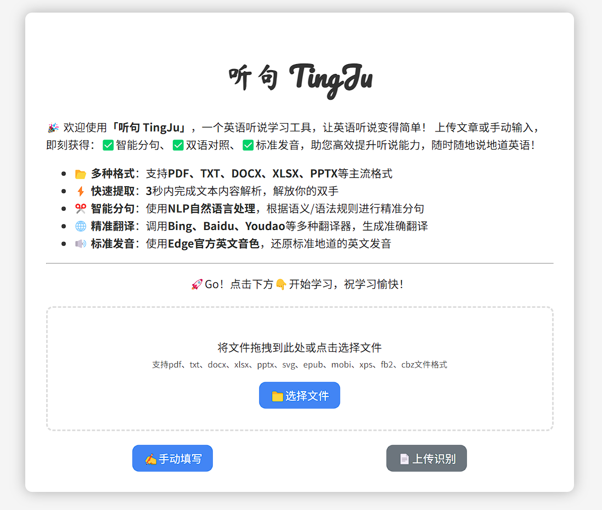
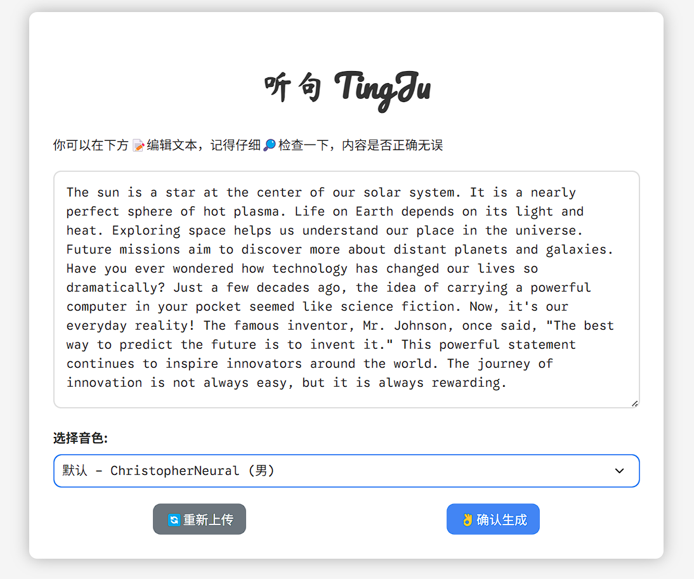
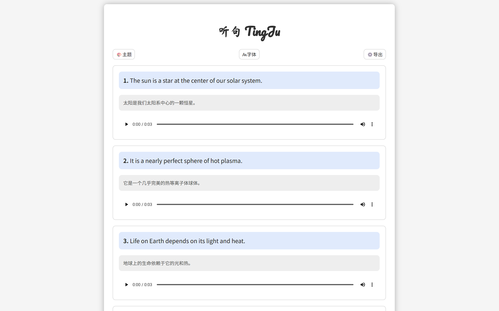
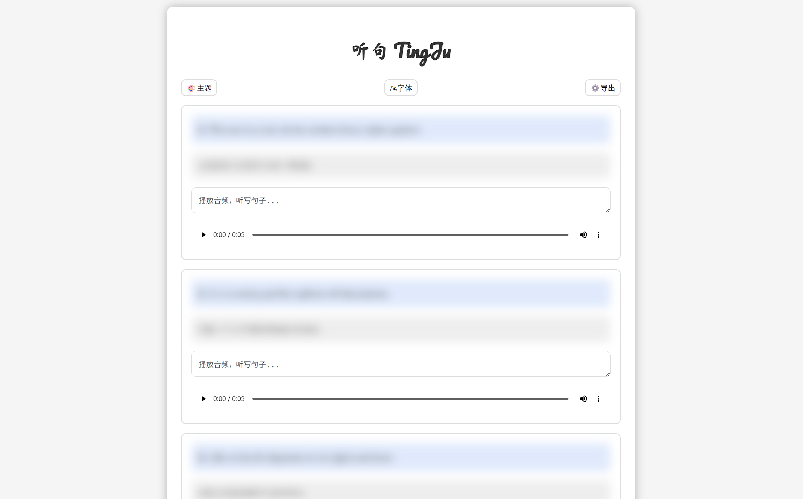
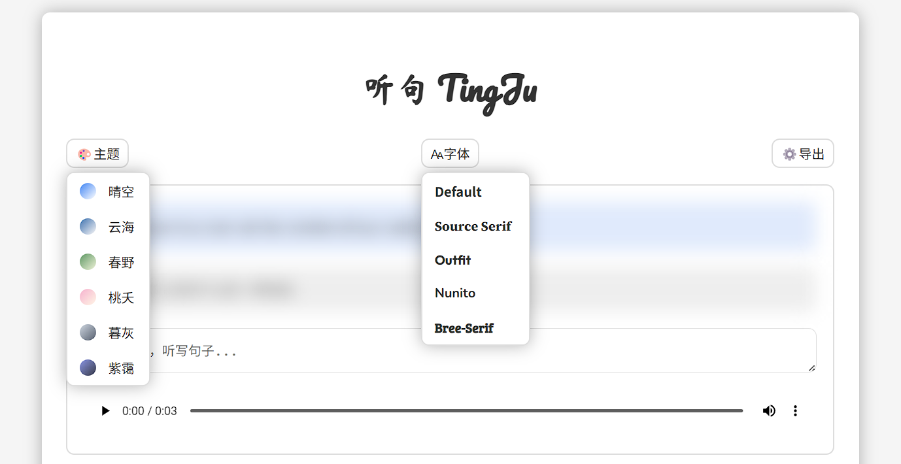
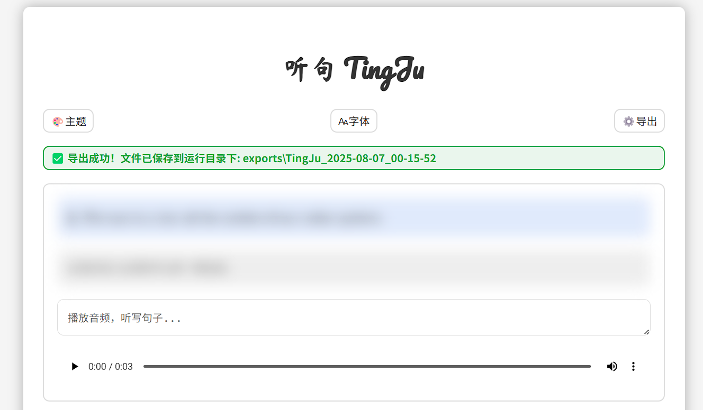

<head>
<link rel="preconnect" href="https://fonts.googleapis.com">
<link rel="preconnect" href="https://fonts.gstatic.com" crossorigin>
<link href="https://fonts.googleapis.com/css2?family=Ma+Shan+Zheng&family=Pacifico&display=swap" rel="stylesheet">
</head>

<div align="center">
  <h1 align="center" style="font-size: 50px; font-family: 'Pacifico', 'Ma Shan Zheng';">
    听句 TingJu
  </h1>
  
  <p align="center">
    🎧 一个英语听说学习工具 | 让英语听说变得简单！
  </p>
  
  <p align="center">
    
    
    
    
  </p>

  <a href="https://github.com/Pi3-l22/TingJu" target="_blank">
  
  </a>
</div>

## 🌟 简介

**听句 TingJu** 是一个专为英语学习者设计的听说训练工具。通过智能文本处理、精准翻译和高质量语音合成技术，帮助用户提升英语听说能力。

核心功能：
- ✅ **智能分句**：使用NLP自然语言处理技术，根据语义和语法规则进行精准分句
- ✅ **双语对照**：调用多种翻译引擎（Bing、百度、有道等）生成准确翻译
- ✅ **标准发音**：使用Microsoft Edge官方英文音色，还原地道英文发音
- ✅ **句子听写**：支持句子听写功能，隐藏英文与翻译，练习英语听力
- ✅ **多种格式**：支持PDF、TXT、DOCX、XLSX、PPTX等多种文档格式
- ✅ **离线使用**：支持导出功能，在手机电脑平板上随时随地英语听句
- ✅ **多种主题**：内置多种颜色和字体主题，换个主题，换个心情

## 🚀 功能特性

### 📂 多格式文档支持
支持多种主流文档格式，轻松导入学习材料：
- PDF文档
- TXT文本文件
- Word文档（DOCX）
- Excel电子表格（XLSX）
- PowerPoint演示文稿（PPTX）
- 以及其他格式（SVG、EPUB、MOBI、XPS、FB2、CBZ等）

### ✂️ 智能文本处理
- 利用NLTK自然语言处理库进行智能分句
- 自动规范化文本（替换中文标点为英文标点、合并多余空格等）
- 过滤无意义短句，确保学习内容质量

### 🌐 精准翻译
- 集成多种翻译引擎（Bing、百度、有道等）
- 提供高质量的中英文互译
- 翻译结果准确可靠，便于理解

### 🔊 高质量语音合成
- 使用Microsoft Edge TTS技术
- 提供多种英语发音人声选择
- 生成清晰、自然的英语发音音频

### 🎧 英文听力练习
- 支持听写模式，隐藏英文与翻译，通过音频听写句子
- 听不出来？鼠标移入即可显示提示
- 自动检查听写是否正确，避免手动检查消耗时间

### 🖌️ 个性化界面
- 多种主题配色方案（晴空、云海、春野、桃夭、暮灰、紫霭）
- 多种字体选择（Source Sans、Source Serif、Arvo、Outfit、Nunito、Bree-Serif）
- 响应式设计，适配不同设备屏幕

### 📤 离线学习支持
- 一键导出功能，将学习内容打包为独立文件
- 导出包包含所有文本、翻译和音频资源
- 支持离线环境使用，手机平板随时随地学习

## 🛠️ 安装与使用

### 快速开始（推荐）

1. 从 [Release](https://github.com/Pi3-l22/TingJu/releases/latest) 页面下载最新版压缩包
2. 解压并双击运行 TingJu 可执行文件
3. TingJu 会在 2 秒后自动打开默认浏览器，即可开始使用
4. 若未自动打开浏览器，请手动打开浏览器访问 `http://127.0.0.1:51122`

### 从源码启动

1. 克隆项目代码：
```bash
git clone https://github.com/Pi3-l22/TingJu.git
cd TingJu
```

2. 安装依赖：
```bash
pip install -r requirements.txt
```

3. 启动应用：
```bash
python app.py
```

4. 在浏览器中访问 `http://127.0.0.1:51122` 开始使用

### 使用方法

1. **上传文档**：点击"选择文件"按钮或拖拽上传支持格式的英文文档，也可以点击"手动填写"直接输入英文文本



2. **确认文本**：检查并确认提取的文本内容
3. **选择音色**：从可用的英语发音人声中选择喜欢的音色



4. **生成内容**：点击"确认生成"，系统将自动处理文本、生成翻译和音频
5. **听读模式**：点击播放按钮听取标准发音，可根据情况调整播放速度



6. **听写模式**：使用听写模式练习英语听力，鼠标悬浮有提示



7. **主题样式**：通过主题和字体按钮，更换喜欢的颜色和字体样式，换个主题，换个心情



8. **导出内容**：通过右上角导出按钮，将生成的内容导出为离线版本，随时随地手机电脑听读听写



> [!IMPORTANT]
> 由于手机平板等移动设备的安全限制，导出的HTML文件可能无法加载CSS样式、JS脚本功能以及音频文件。
>
> 因此需要您在移动设备上启动一个HTTP服务器，才能正常浏览和播放内容。

## 📁 项目结构

```
TingJu/
├── app.py                 # 主应用文件
├── requirements.txt       # 项目依赖
├── static/                # 静态资源
│   ├── css/               # 样式文件
│   ├── js/                # JavaScript文件
│   └── img/               # 图片资源
├── templates/             # HTML模板
├── utils/                 # 工具模块
│   ├── audio_generator.py # 音频生成
│   ├── file_processor.py  # 文件处理
│   ├── logger.py          # 日志记录
│   ├── text_processor.py  # 文本处理
│   └── text_translator.py # 文本翻译
├── temp/                  # 临时文件目录
├── audios/                # 音频文件目录
└── exports/               # 导出文件目录
```

## 🧩 技术架构

- 前端使用原生 HTML + CSS + JavaScript
- 后端使用 Python + FastAPI + Uvicorn

## 🤝 贡献

欢迎任何形式的贡献！如果您有改进建议、新功能想法或发现了bug，请：

1. Fork 本仓库
2. 创建您的特性分支 (`git checkout -b feature/AmazingFeature`)
3. 提交您的更改 (`git commit -m 'Add some AmazingFeature'`)
4. 推送到分支 (`git push origin feature/AmazingFeature`)
5. 开启一个 Pull Request

## 📄 许可证

本项目采用 AGPL 许可证。详情请见 [LICENSE](LICENSE) 文件。

## 🙏 致谢

感谢本项目中所使用的开源项目：

- **后端框架**：[FastAPI](https://fastapi.tiangolo.com/) - 现代、快速（高性能）的Python Web框架
- **TTS引擎**：[edge-tts](https://github.com/rany2/edge-tts) - Microsoft Edge TTS的Python接口
- **文本处理**：[NLTK](https://www.nltk.org/) - 自然语言处理工具包
- **翻译服务**：[translators](https://pypi.org/project/translators/) - 多平台翻译库
- **文档处理**：[PyMuPDF](https://pymupdf.readthedocs.io/) - PDF和文档处理库
- **模板引擎**：[Jinja2](https://jinja.palletsprojects.com/) - 现代和设计友好的Python模板引擎

## 📧 联系方式

- 项目链接：[https://github.com/Pi3-l22/TingJu](https://github.com/Pi3-l22/TingJu)
- 个人博客：[https://blog.pi3.fun](https://blog.pi3.fun)